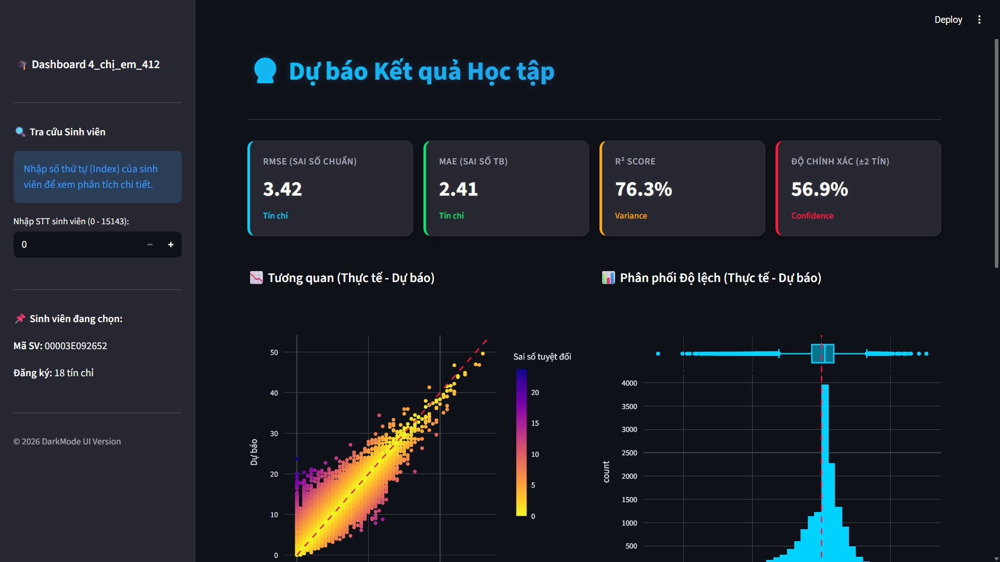

# 🏆 Student Learning Progress Prediction

<div align="center">


**Team:** 4 chị em 412

*An End-to-End Machine Learning Pipeline for Predicting Student Learning Outcomes*

[English](#english) | [Tiếng Việt](#tiếng-việt)

</div>

---

## <a name="english"></a>🇬🇧 English

### 📋 Overview

This project builds an end-to-end machine learning pipeline for predicting student learning progress and outcomes. The solution includes:

- 🔍 Comprehensive Exploratory Data Analysis (EDA)
- ✨ Advanced feature engineering
- 🤖 Ensemble modeling (LightGBM, XGBoost, CatBoost)
- 📊 Interactive dashboard with Explainable AI (SHAP)
- 🎯 Production-ready deployment

### 🎯 Key Features

- **Data Exploration**: In-depth EDA with visualizations and statistical analysis
- **Ensemble Learning**: Combines multiple gradient boosting algorithms for superior predictions
- **Explainability**: SHAP values provide interpretable model insights
- **Interactive Dashboard**: Streamlit-based web interface for result visualization
- **Reproducible Pipeline**: Complete notebook-based training workflow

### 🛠 Prerequisites

**System Requirements:**
- **Operating System:** Windows 10/11, Linux (Ubuntu 20.04+), or MacOS
- **Python:** Version 3.13.5 (or equivalent 3.13.x version)
- **RAM:** Minimum 8GB (16GB recommended for training)
- **Storage:** At least 1GB free space

### ⚙️ Installation

**Step 1:** Clone the repository
```bash
git clone https://github.com/duccminhh-cyber/learning-progress-prediction.git
cd learning-progress-prediction
```

**Step 2:** Create the `data` folder and add required datasets

> ⚠️ **IMPORTANT:** The `data` folder is not included in the repository as per competition requirements. You must create it manually.

Create the `data` folder in the project root:
```bash
mkdir data
```

Then, place the following files inside the `data/` folder:
- `academic_records.csv` - Student academic history data
- `admission.csv` - Student admission information
- `test.csv` - Test dataset for predictions

Your project structure should look like this:
```
learning-progress-prediction/
├── data/                        # ← Create this folder
│   ├── academic_records.csv     # ← Add these files
│   ├── admission.csv
│   └── test.csv
├── dashboard/
├── model/
└── ...
```

**Step 3:** Install dependencies
```bash
pip install -r requirements.txt
```

> ⏱️ Installation may take a few minutes due to heavy libraries (catboost, shap, streamlit)

### 🚀 Quick Start

> ⚠️ **IMPORTANT:** Ensure you have created the `data` folder and added the required CSV files before proceeding.

#### **Step 0: Exploratory Data Analysis (Optional)**

To understand the dataset before training:

1. Open `src/EDA.ipynb` in Jupyter Notebook or VS Code
2. Select the Python kernel with installed dependencies
3. Run all cells sequentially to see:
   - Data distributions and statistics
   - Missing value analysis
   - Feature correlations
   - Visualization of key patterns

#### **Step 1: Train the Model**

1. Open `src/pipeline.ipynb` in Jupyter Notebook or VS Code
2. Select the Python kernel with installed dependencies
3. Run all cells sequentially (Run All)

**Output Files:**
- `model/ensemble_models_grandmaster.pkl` - Trained ensemble model
- `dashboard/dashboard_data.pkl` - Dashboard data

#### **Step 2: Generate Predictions**

Predictions on the test set will be automatically saved to `result/submission_final.csv` after completing Step 1.

#### **Step 3: Launch Dashboard**

To run the interactive dashboard:

1. Navigate to the `dashboard` folder where `app.py` is located:
```bash
cd dashboard
```

2. Run the Streamlit application:
```bash
streamlit run app.py
```

3. Your default browser will automatically open and display the dashboard at: **http://localhost:8501**

> 💡 **Tip:** If the browser doesn't open automatically, manually navigate to the URL shown in the terminal.

### 📊 Dashboard Features

The interactive dashboard provides comprehensive insights into model predictions and performance:



#### **Main Features:**

🎯 **Student Lookup**
- Search students by ID (Index) to view detailed predictions
- Input student ID (0-15143) to get individual analysis

📈 **Performance Metrics**
- **RMSE (Root Mean Square Error)**: Model accuracy indicator
- **MAE (Mean Absolute Error)**: Average prediction error
- **R² Score**: Variance explanation (76.3%)
- **Accuracy (±2 credits)**: Prediction confidence (56.9%)

🔍 **Explainable AI (SHAP Analysis)**
- **SHAP Waterfall Plot**: Shows how each feature contributes to individual predictions
- Feature importance visualization
- Positive/negative impact analysis of each feature
- Understand why the model made specific predictions

📊 **Visualization Charts**
- **Actual vs Predicted Scatter Plot**: Compare real outcomes with predictions
- **Error Distribution Histogram**: Analyze prediction accuracy patterns
- Color-coded by absolute error for easy interpretation

📋 **Raw Data Viewer**
- Access complete student information
- View predicted scores, actual scores, and errors
- Sortable and searchable data table
- Export functionality for further analysis

⚠️ **Alert System**
- Automatic warnings for at-risk students
- Identifies students with low predicted scores
- Helps prioritize interventions

### 📂 Project Structure

```
learning-progress-prediction/
├── data/                        # Raw input data (CREATE THIS FOLDER)
│   ├── academic_records.csv     # Academic history
│   ├── admission.csv            # Admission information
│   └── test.csv                 # Test dataset for predictions
│
├── dashboard/                   # Dashboard application
│   ├── app.py                   # Streamlit dashboard application
│   └── dashboard_data.pkl       # Processed data (SHAP, metrics)
│
├── model/                       # Trained models
│   └── ensemble_models_grandmaster.pkl  # Ensemble model (LGBM + XGB + CatBoost)
│
├── result/                      # Output results
│   └── submission_final.csv     # Final submission file
│
├── src/                         # Source code
│   ├── EDA.ipynb                # Exploratory Data Analysis notebook
│   └── pipeline.ipynb           # Training & evaluation notebook
│
├── requirements.txt             # Python dependencies
├── .gitignore                   # Git ignore configuration
├── LICENSE                      # MIT License
└── README.md                    # This file
```

### 📊 Workflow

```
1. Setup data folder          →  Create data/ and add CSV files
2. EDA.ipynb                  →  Explore & understand the data
3. pipeline.ipynb             →  Train models & generate predictions
4. app.py                     →  Visualize results & explain predictions
```

### 🔧 Important Notes

- **Data Folder**: The `data` folder is excluded from the repository per competition requirements. You must create it and add the required CSV files manually.
- **File Paths**: The application automatically loads data from the `data/` folder. Ensure all files are placed correctly.
- **Dashboard Data**: `dashboard_data.pkl` is stored in the `dashboard/` folder along with `app.py`.

### 📈 Model Performance

The ensemble model combines three powerful gradient boosting algorithms:
- **LightGBM** - Fast training and efficient memory usage
- **XGBoost** - Robust regularization and high accuracy
- **CatBoost** - Excellent handling of categorical features

**Achieved Metrics:**
- **R² Score**: 76.3% (Strong variance explanation)
- **RMSE**: 3.42 (Low prediction error)
- **MAE**: 2.41 (Consistent accuracy)
- **Accuracy (±2 credits)**: 56.9% (High precision predictions)

### 🔍 Explainability

The dashboard provides SHAP (SHapley Additive exPlanations) visualizations to understand:
- **Feature importance**: Which factors most influence predictions
- **Individual predictions**: Detailed breakdown of each student's predicted outcome
- **Model transparency**: Clear explanation of decision-making process
- **Positive/Negative impacts**: How each feature affects the final prediction

### 📝 License

This project is licensed under the MIT License - see the [LICENSE](LICENSE) file for details.

### 👥 Team

**Team 4 chị em 412**

Competition: DataFlow Season 2

### 🤝 Contributing

This solution is owned by Team 4 chị em 412. The source code is open for the DataFlow competition organizers for evaluation and non-commercial purposes.

---

## <a name="tiếng-việt"></a>🇻🇳 Tiếng Việt

### 📋 Tổng quan

Dự án xây dựng pipeline End-to-End từ phân tích dữ liệu khám phá (EDA), xử lý dữ liệu, huấn luyện mô hình Ensemble (LightGBM, XGBoost, CatBoost) đến triển khai Dashboard tương tác với Explainable AI (SHAP) để giải thích kết quả dự báo tiến độ và kết quả học tập sinh viên.

### 🎯 Tính năng chính

- **Phân tích dữ liệu khám phá**: EDA chi tiết với trực quan hóa và phân tích thống kê
- **Ensemble Learning**: Kết hợp nhiều thuật toán gradient boosting cho độ chính xác cao
- **Khả năng giải thích**: SHAP values cung cấp cái nhìn chi tiết về mô hình
- **Dashboard tương tác**: Giao diện web Streamlit để hiển thị kết quả
- **Pipeline tái tạo được**: Quy trình huấn luyện đầy đủ bằng notebook

### 🛠 Yêu cầu hệ thống

**Cấu hình tối thiểu:**
- **Hệ điều hành:** Windows 10/11, Linux (Ubuntu 20.04+), hoặc MacOS
- **Python:** Phiên bản 3.13.5 (hoặc phiên bản tương đương 3.13.x)
- **RAM:** Tối thiểu 8GB (Khuyến nghị 16GB để chạy Training Pipeline)
- **Ổ cứng:** Trống tối thiểu 1GB

### ⚙️ Cài đặt

**Bước 1:** Clone repository về máy
```bash
git clone https://github.com/duccminhh-cyber/learning-progress-prediction.git
cd learning-progress-prediction
```

**Bước 2:** Tạo thư mục `data` và thêm các tập dữ liệu cần thiết

> ⚠️ **QUAN TRỌNG:** Thư mục `data` không được đưa vào repository theo yêu cầu của BTC. Bạn phải tạo thư mục này thủ công.

Tạo thư mục `data` trong thư mục gốc của dự án:
```bash
mkdir data
```

Sau đó, đặt các file sau vào trong thư mục `data/`:
- `academic_records.csv` - Dữ liệu lịch sử học tập sinh viên
- `admission.csv` - Thông tin tuyển sinh sinh viên
- `test.csv` - Tập dữ liệu cần dự báo

Cấu trúc dự án của bạn sẽ như sau:
```
learning-progress-prediction/
├── data/                        # ← Tạo thư mục này
│   ├── academic_records.csv     # ← Thêm các file này
│   ├── admission.csv
│   └── test.csv
├── dashboard/
├── model/
└── ...
```

**Bước 3:** Cài đặt các thư viện phụ thuộc
```bash
pip install -r requirements.txt
```

> ⏱️ Quá trình cài đặt có thể mất vài phút do bao gồm các thư viện nặng như catboost, shap, streamlit

### 🚀 Hướng dẫn chạy

> ⚠️ **QUAN TRỌNG:** Đảm bảo bạn đã tạo thư mục `data` và thêm các file CSV cần thiết trước khi tiếp tục.

#### **Bước 0: Phân tích dữ liệu khám phá (Tùy chọn)**

Để hiểu rõ dữ liệu trước khi huấn luyện:

1. Mở file `src/EDA.ipynb` bằng Jupyter Notebook hoặc VS Code
2. Chọn Kernel Python đã cài đặt thư viện
3. Chạy tuần tự các cell để xem:
   - Phân bố và thống kê dữ liệu
   - Phân tích giá trị thiếu
   - Tương quan giữa các đặc trưng
   - Trực quan hóa các mẫu quan trọng

#### **Bước 1: Tiền xử lý & Huấn luyện mô hình**

1. Mở file `src/pipeline.ipynb` bằng Jupyter Notebook hoặc VS Code
2. Chọn Kernel Python đã cài đặt thư viện ở Bước 3
3. Nhấn **Run All** để chạy tuần tự từ trên xuống dưới

**Kết quả sinh ra:**
- `model/ensemble_models_grandmaster.pkl` - Mô hình dự báo
- `dashboard/dashboard_data.pkl` - Dữ liệu cho Dashboard

#### **Bước 2: Sinh kết quả dự báo**

Kết quả dự báo trên tập Test sẽ được lưu tự động vào `result/submission_final.csv` sau khi chạy xong Bước 1.

#### **Bước 3: Khởi chạy Dashboard**

Để chạy giao diện Dashboard tương tác:

1. Di chuyển vào thư mục `dashboard` nơi chứa file `app.py`:
```bash
cd dashboard
```

2. Chạy ứng dụng Streamlit:
```bash
streamlit run app.py
```

3. Trình duyệt sẽ tự động mở và hiển thị giao diện Dashboard tại địa chỉ: **http://localhost:8501**

> 💡 **Mẹo:** Nếu trình duyệt không tự động mở, hãy truy cập thủ công vào địa chỉ URL hiển thị trong Terminal.

### 📊 Tính năng Dashboard

Dashboard tương tác cung cấp cái nhìn toàn diện về dự đoán và hiệu suất mô hình:


#### **Tính năng chính:**

🎯 **Tra cứu Sinh viên**
- Tìm kiếm sinh viên theo mã số (Index) để xem phân tích chi tiết
- Nhập mã sinh viên (0-15143) để nhận phân tích cá nhân

📈 **Chỉ số Hiệu suất**
- **RMSE (Sai số Chuẩn)**: Chỉ số độ chính xác mô hình
- **MAE (Sai số Tuyệt đối TB)**: Sai số dự đoán trung bình
- **R² Score**: Khả năng giải thích phương sai (76.3%)
- **Độ chính xác (±2 tín chỉ)**: Độ tin cậy dự đoán (56.9%)

🔍 **Phân tích AI Giải thích được (SHAP)**
- **Biểu đồ SHAP Waterfall**: Hiển thị cách mỗi đặc trưng đóng góp vào dự đoán cá nhân
- Trực quan hóa tầm quan trọng đặc trưng
- Phân tích tác động tích cực/tiêu cực của từng đặc trưng
- Hiểu tại sao mô hình đưa ra dự đoán cụ thể

📊 **Biểu đồ Trực quan**
- **Biểu đồ Phân tán Thực tế vs Dự báo**: So sánh kết quả thực với dự đoán
- **Biểu đồ Phân bố Sai số**: Phân tích mẫu độ chính xác dự đoán
- Mã màu theo sai số tuyệt đối để dễ diễn giải

📋 **Xem Dữ liệu Thô**
- Truy cập thông tin sinh viên đầy đủ
- Xem điểm dự đoán, điểm thực tế và sai số
- Bảng dữ liệu có thể sắp xếp và tìm kiếm
- Chức năng xuất để phân tích thêm

⚠️ **Hệ thống Cảnh báo**
- Cảnh báo tự động cho sinh viên có nguy cơ
- Xác định sinh viên có điểm dự đoán thấp
- Giúp ưu tiên can thiệp

### 📂 Cấu trúc dự án

```
learning-progress-prediction/
├── data/                        # Chứa dữ liệu đầu vào (TẠO THƯ MỤC NÀY)
│   ├── academic_records.csv     # Lịch sử học tập
│   ├── admission.csv            # Thông tin tuyển sinh
│   └── test.csv                 # Tập dữ liệu cần dự báo
│
├── dashboard/                   # Ứng dụng Dashboard
│   ├── app.py                   # Giao diện Dashboard (Streamlit)
│   └── dashboard_data.pkl       # File dữ liệu đã xử lý (SHAP, Metrics...)
│
├── model/                       # Chứa Model đã huấn luyện
│   └── ensemble_models_grandmaster.pkl  # Model tổng hợp (LGBM + XGB + CatBoost)
│
├── result/                      # Chứa kết quả đầu ra
│   └── submission_final.csv     # File kết quả nộp bài (Submission)
│
├── src/                         # Mã nguồn chính (Source Code)
│   ├── EDA.ipynb                # Notebook phân tích dữ liệu khám phá
│   └── pipeline.ipynb           # Notebook Training, Feature Eng. & Evaluation
│
├── requirements.txt             # Danh sách các thư viện cần cài đặt
├── .gitignore                   # Cấu hình file ẩn khỏi Git
├── LICENSE                      # Giấy phép mã nguồn
└── README.md                    # Tài liệu hướng dẫn sử dụng (File này)
```

### 📊 Quy trình làm việc

```
1. Thiết lập thư mục data      →  Tạo data/ và thêm các file CSV
2. EDA.ipynb                   →  Khám phá & hiểu dữ liệu
3. pipeline.ipynb              →  Huấn luyện mô hình & tạo dự đoán
4. app.py                      →  Trực quan hóa kết quả & giải thích dự đoán
```

### 🔧 Lưu ý quan trọng

- **Thư mục Data**: Thư mục `data` không được đưa vào repository theo yêu cầu của BTC. Bạn phải tạo thư mục này và thêm các file CSV cần thiết thủ công.
- **Đường dẫn File**: Ứng dụng tự động tải dữ liệu từ thư mục `data/`. Đảm bảo tất cả các file được đặt đúng vị trí.
- **Dữ liệu Dashboard**: File `dashboard_data.pkl` được lưu trong thư mục `dashboard/` cùng với `app.py`.


**Chỉ số đạt được:**
- **R² Score**: 76.3% (Giải thích phương sai tốt)
- **RMSE**: 3.42 (Sai số dự đoán thấp)
- **MAE**: 2.41 (Độ chính xác ổn định)
- **Độ chính xác (±2 tín chỉ)**: 56.9% (Dự đoán chính xác cao)

### 🔍 Khả năng giải thích

Dashboard cung cấp trực quan hóa SHAP (SHapley Additive exPlanations) để hiểu:
- **Tầm quan trọng đặc trưng**: Yếu tố nào ảnh hưởng nhiều nhất đến dự đoán
- **Dự đoán cá nhân**: Phân tích chi tiết kết quả dự đoán của từng sinh viên
- **Tính minh bạch mô hình**: Giải thích rõ ràng quá trình ra quyết định
- **Tác động Tích cực/Tiêu cực**: Cách mỗi đặc trưng ảnh hưởng đến dự đoán cuối cùng

### 📝 Bản quyền

Giải pháp thuộc quyền sở hữu của nhóm **4 chị em 412**. Mã nguồn được mở cho BTC DataFlow sử dụng với mục đích chấm thi và phi thương mại.

### 👥 Đội ngũ

**Team 4 chị em 412**

Cuộc thi: DataFlow Season 2

### 🙏 Acknowledgments

- DataFlow Season 2 Competition
- Open-source ML community
- SHAP library for explainability
- Scikit-learn, Pandas, and NumPy communities

---

<div align="center">

**Made with ❤️ by Team 4 chị em 412**

⭐ Star this repo if you find it helpful!

</div>
